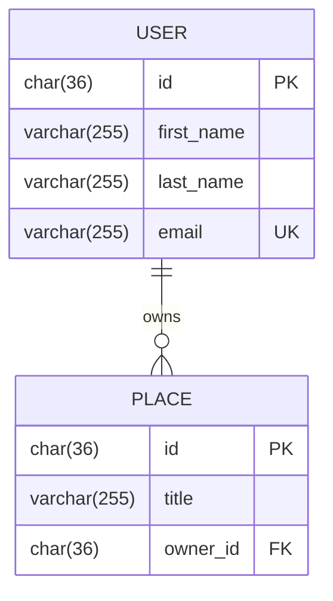
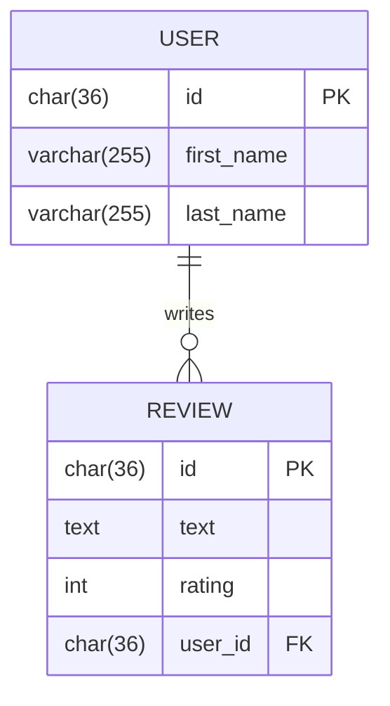
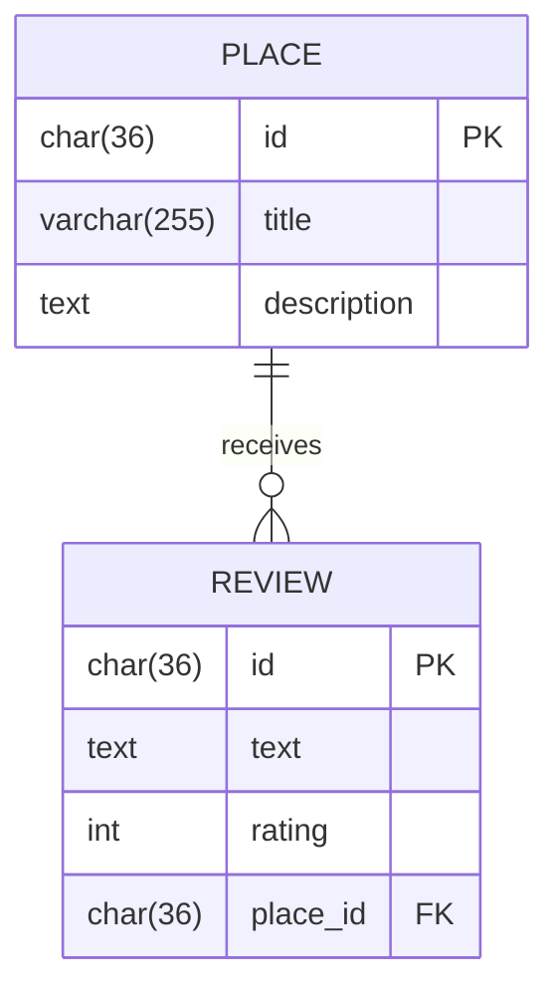
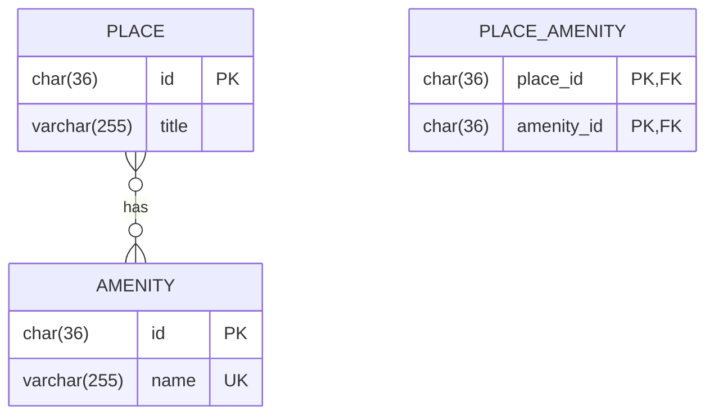

# HBnB Database Schema - Entity Relationship Diagram

This document contains the Entity-Relationship (ER) diagrams for the HBnB application database schema, created using Mermaid.js.

## Complete Database Schema

```mermaid
erDiagram
    USER ||--o{ PLACE : owns
    USER ||--o{ REVIEW : writes
    PLACE ||--o{ REVIEW : receives
    PLACE }o--o{ AMENITY : has

    USER {
        char(36) id PK
        varchar(255) first_name
        varchar(255) last_name
        varchar(255) email UK
        varchar(255) password
        boolean is_admin
        timestamp created_at
        timestamp updated_at
    }

    PLACE {
        char(36) id PK
        varchar(255) title
        text description
        decimal(10,2) price
        float latitude
        float longitude
        char(36) owner_id FK
        timestamp created_at
        timestamp updated_at
    }

    REVIEW {
        char(36) id PK
        text text
        int rating
        char(36) user_id FK
        char(36) place_id FK
        timestamp created_at
        timestamp updated_at
    }

    AMENITY {
        char(36) id PK
        varchar(255) name UK
        timestamp created_at
        timestamp updated_at
    }

    PLACE_AMENITY {
        char(36) place_id PK,FK
        char(36) amenity_id PK,FK
    }
```

## Relationship Explanations

### One-to-Many Relationships

#### 1. User → Place (owns)

- **Relationship**: One user can own many places
- **Foreign Key**: `PLACE.owner_id` references `USER.id`
- **Cascade**: Deleting a user deletes all their places

#### 2. User → Review (writes)

- **Relationship**: One user can write many reviews
- **Foreign Key**: `REVIEW.user_id` references `USER.id`
- **Cascade**: Deleting a user deletes all their reviews

#### 3. Place → Review (receives)

- **Relationship**: One place can have many reviews
- **Foreign Key**: `REVIEW.place_id` references `PLACE.id`
- **Constraint**: Each user can only review a place once (UNIQUE constraint on user_id, place_id)
- **Cascade**: Deleting a place deletes all its reviews

### Many-to-Many Relationship

#### 4. Place ↔ Amenity (has)

- **Relationship**: Many places can have many amenities
- **Junction Table**: `PLACE_AMENITY` connects places and amenities
- **Foreign Keys**:
  - `PLACE_AMENITY.place_id` references `PLACE.id`
  - `PLACE_AMENITY.amenity_id` references `AMENITY.id`
- **Composite Primary Key**: (`place_id`, `amenity_id`)
- **Cascade**: Deleting a place or amenity removes the associations

## Detailed Entity Descriptions

### USER Table
**Purpose**: Stores user account information

| Column | Type | Constraints | Description |
|--------|------|-------------|-------------|
| id | CHAR(36) | PRIMARY KEY | UUID for user |
| first_name | VARCHAR(255) | NOT NULL | User's first name |
| last_name | VARCHAR(255) | NOT NULL | User's last name |
| email | VARCHAR(255) | UNIQUE, NOT NULL | User's email address |
| password | VARCHAR(255) | NOT NULL | Bcrypt hashed password |
| is_admin | BOOLEAN | DEFAULT FALSE | Admin flag |
| created_at | TIMESTAMP | DEFAULT NOW | Creation timestamp |
| updated_at | TIMESTAMP | AUTO UPDATE | Last update timestamp |

**Indexes**:
- Primary Key on `id`
- Unique Index on `email`

---

### PLACE Table
**Purpose**: Stores place listings

| Column | Type | Constraints | Description |
|--------|------|-------------|-------------|
| id | CHAR(36) | PRIMARY KEY | UUID for place |
| title | VARCHAR(255) | NOT NULL | Place title |
| description | TEXT | NULL | Detailed description |
| price | DECIMAL(10,2) | NOT NULL, CHECK > 0 | Price per night |
| latitude | FLOAT | NOT NULL, CHECK [-90, 90] | GPS latitude |
| longitude | FLOAT | NOT NULL, CHECK [-180, 180] | GPS longitude |
| owner_id | CHAR(36) | FOREIGN KEY, NOT NULL | Reference to USER |
| created_at | TIMESTAMP | DEFAULT NOW | Creation timestamp |
| updated_at | TIMESTAMP | AUTO UPDATE | Last update timestamp |

**Foreign Keys**:
- `owner_id` → `USER.id` (CASCADE DELETE)

**Indexes**:
- Primary Key on `id`
- Index on `owner_id`

---

### REVIEW Table
**Purpose**: Stores user reviews for places

| Column | Type | Constraints | Description |
|--------|------|-------------|-------------|
| id | CHAR(36) | PRIMARY KEY | UUID for review |
| text | TEXT | NOT NULL | Review content |
| rating | INT | NOT NULL, CHECK [1, 5] | Rating 1-5 stars |
| user_id | CHAR(36) | FOREIGN KEY, NOT NULL | Reference to USER |
| place_id | CHAR(36) | FOREIGN KEY, NOT NULL | Reference to PLACE |
| created_at | TIMESTAMP | DEFAULT NOW | Creation timestamp |
| updated_at | TIMESTAMP | AUTO UPDATE | Last update timestamp |

**Foreign Keys**:
- `user_id` → `USER.id` (CASCADE DELETE)
- `place_id` → `PLACE.id` (CASCADE DELETE)

**Unique Constraints**:
- UNIQUE (`user_id`, `place_id`) - One review per user per place

**Indexes**:
- Primary Key on `id`
- Index on `user_id`
- Index on `place_id`

---

### AMENITY Table
**Purpose**: Stores available amenities

| Column | Type | Constraints | Description |
|--------|------|-------------|-------------|
| id | CHAR(36) | PRIMARY KEY | UUID for amenity |
| name | VARCHAR(255) | UNIQUE, NOT NULL | Amenity name |
| created_at | TIMESTAMP | DEFAULT NOW | Creation timestamp |
| updated_at | TIMESTAMP | AUTO UPDATE | Last update timestamp |

**Indexes**:
- Primary Key on `id`
- Unique Index on `name`

---

### PLACE_AMENITY Table (Junction Table)
**Purpose**: Associates places with amenities (many-to-many)

| Column | Type | Constraints | Description |
|--------|------|-------------|-------------|
| place_id | CHAR(36) | PRIMARY KEY, FOREIGN KEY | Reference to PLACE |
| amenity_id | CHAR(36) | PRIMARY KEY, FOREIGN KEY | Reference to AMENITY |

**Foreign Keys**:
- `place_id` → `PLACE.id` (CASCADE DELETE)
- `amenity_id` → `AMENITY.id` (CASCADE DELETE)

**Composite Primary Key**: (`place_id`, `amenity_id`)

**Indexes**:
- Composite Primary Key on (`place_id`, `amenity_id`)
- Index on `place_id`
- Index on `amenity_id`

---

## Mermaid.js Relationship Notation

| Notation | Meaning | Description |
|----------|---------|-------------|
| `\|\|--o{` | One-to-Many | One entity relates to zero or more of another |
| `}o--o{` | Many-to-Many | Many entities relate to many others |
| `\|\|--\|\|` | One-to-One | One entity relates to exactly one other |
| `o{` | Zero or More | Optional relationship with multiple records |
| `\|\|` | Exactly One | Required relationship with single record |

## Cardinality Symbols

- `|o` : Zero or one
- `||` : Exactly one
- `}o` : Zero or many
- `}|` : One or many

## Database Constraints Summary

### Primary Keys
- All tables use UUID (CHAR(36)) as primary key
- Format: `xxxxxxxx-xxxx-xxxx-xxxx-xxxxxxxxxxxx`

### Foreign Keys with Cascade
- `PLACE.owner_id` → `USER.id` (CASCADE DELETE)
- `REVIEW.user_id` → `USER.id` (CASCADE DELETE)
- `REVIEW.place_id` → `PLACE.id` (CASCADE DELETE)
- `PLACE_AMENITY.place_id` → `PLACE.id` (CASCADE DELETE)
- `PLACE_AMENITY.amenity_id` → `AMENITY.id` (CASCADE DELETE)

### Unique Constraints
- `USER.email` - Ensures no duplicate emails
- `AMENITY.name` - Ensures no duplicate amenity names
- `REVIEW(user_id, place_id)` - One review per user per place

### Check Constraints
- `PLACE.price > 0` - Price must be positive
- `PLACE.latitude BETWEEN -90 AND 90` - Valid latitude range
- `PLACE.longitude BETWEEN -180 AND 180` - Valid longitude range
- `REVIEW.rating BETWEEN 1 AND 5` - Rating must be 1-5 stars

## How to View/Edit These Diagrams

### Online Editor
1. Visit [Mermaid Live Editor](https://mermaid.live)
2. Copy the Mermaid code from this document
3. Paste it into the editor
4. The diagram will render automatically
5. Export as PNG, SVG, or copy the link

### GitHub/GitLab
These Mermaid diagrams render automatically on GitHub and GitLab when included in markdown files within code blocks tagged with `mermaid`.

### VS Code
Install the "Markdown Preview Mermaid Support" extension to view diagrams directly in VS Code.

### Command Line
```bash
# Install mermaid-cli
npm install -g @mermaid-js/mermaid-cli

# Generate PNG from markdown
mmdc -i DATABASE_DIAGRAM.md -o database_diagram.png
```

## Example Queries Based on Relationships

### Get all places owned by a user
```sql
SELECT p.*
FROM places p
INNER JOIN users u ON p.owner_id = u.id
WHERE u.email = 'admin@hbnb.io';
```

### Get all reviews for a place with user info
```sql
SELECT r.*, u.first_name, u.last_name
FROM reviews r
INNER JOIN users u ON r.user_id = u.id
WHERE r.place_id = 'some-place-uuid';
```

### Get all amenities for a place
```sql
SELECT a.*
FROM amenities a
INNER JOIN place_amenity pa ON a.id = pa.amenity_id
WHERE pa.place_id = 'some-place-uuid';
```

### Get all places with a specific amenity
```sql
SELECT p.*
FROM places p
INNER JOIN place_amenity pa ON p.id = pa.place_id
INNER JOIN amenities a ON pa.amenity_id = a.id
WHERE a.name = 'WiFi';
```

## Database Evolution Considerations

### Potential Future Entities

#### Booking/Reservation
```mermaid
erDiagram
    USER ||--o{ BOOKING : makes
    PLACE ||--o{ BOOKING : receives

    BOOKING {
        char(36) id PK
        char(36) user_id FK
        char(36) place_id FK
        date check_in
        date check_out
        decimal(10,2) total_price
        varchar(50) status
        timestamp created_at
    }
```

#### Payment
```mermaid
erDiagram
    BOOKING ||--|| PAYMENT : has

    PAYMENT {
        char(36) id PK
        char(36) booking_id FK
        decimal(10,2) amount
        varchar(50) payment_method
        varchar(50) status
        timestamp created_at
    }
```

---

**Generated for**: HBnB Evolution Project - Part 3
**Date**: 2026
**Tool**: Mermaid.js v10.x
**Database**: MySQL/PostgreSQL/SQLite compatible
