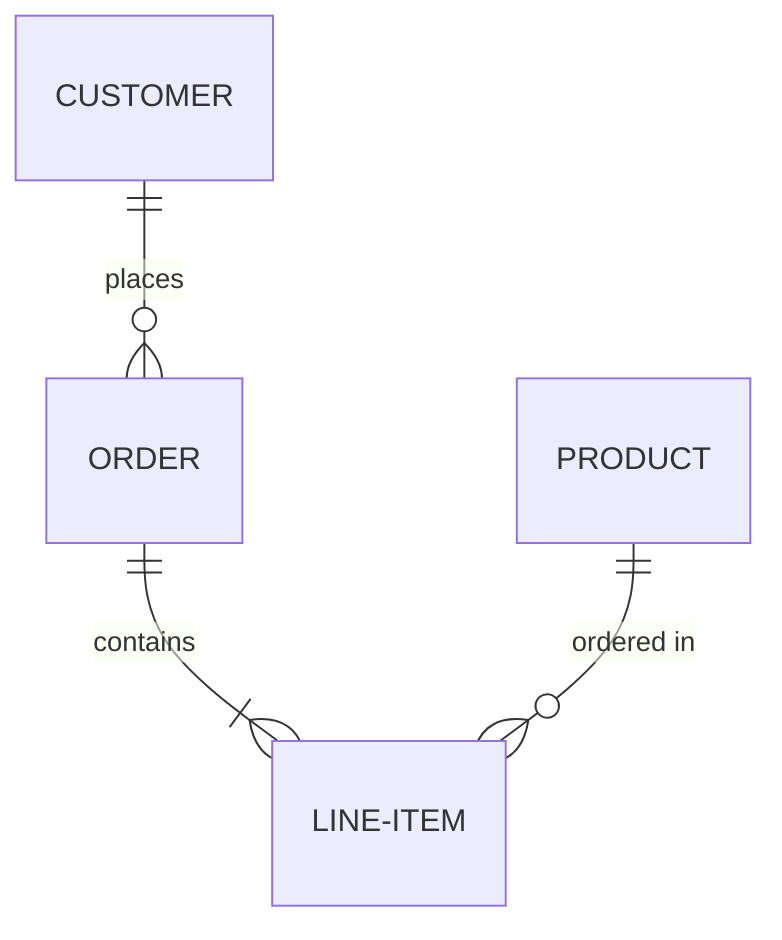

# HBnB Database Diagrams

This directory contains Entity-Relationship diagrams and relationship documentation for the HBnB application database.

## Files

### 1. `er_diagram_simple.md`
**Quick reference ER diagram** with simplified entity representations.
- Best for: Quick overview of database structure
- Shows: Basic entities and relationships
- Format: Mermaid.js erDiagram

### 2. `sqlalchemy_relationships.md`
**SQLAlchemy ORM relationship documentation** showing how models are connected.
- Best for: Understanding Python ORM code
- Shows: Relationship definitions, backrefs, navigation patterns
- Format: Mermaid.js graph + code examples

## Viewing the Diagrams

### GitHub/GitLab
Diagrams render automatically when viewing markdown files on GitHub/GitLab.

### Online Mermaid Editor
1. Visit [Mermaid Live Editor](https://mermaid.live)
2. Copy the code from any `.md` file
3. Paste into the editor
4. View and export the diagram

### VS Code
Install the "Markdown Preview Mermaid Support" extension:
```bash
code --install-extension bierner.markdown-mermaid
```

Then open any `.md` file and use the preview pane (Ctrl+Shift+V).

### Command Line Export
```bash
# Install mermaid-cli globally
npm install -g @mermaid-js/mermaid-cli

# Export as PNG
mmdc -i er_diagram_simple.md -o er_diagram.png

# Export as SVG
mmdc -i er_diagram_simple.md -o er_diagram.svg
```

## Quick Reference

### Entity Summary
- **USER**: User accounts (owners and reviewers)
- **PLACE**: Property listings
- **REVIEW**: User reviews for places
- **AMENITY**: Available amenities (WiFi, Pool, etc.)
- **PLACE_AMENITY**: Junction table for place-amenity associations

### Relationships
1. **User → Place**: One-to-Many (owns)
2. **User → Review**: One-to-Many (writes)
3. **Place → Review**: One-to-Many (has)
4. **Place ↔ Amenity**: Many-to-Many (includes)

### Key Constraints
- User email: UNIQUE
- Amenity name: UNIQUE
- Review (user_id, place_id): UNIQUE
- Review rating: 1-5
- Place price: > 0
- All foreign keys: CASCADE DELETE

## Related Documentation

- **Main Diagram**: `../DATABASE_DIAGRAM.md` - Comprehensive ER documentation
- **SQL Scripts**: `../sql/` - Database creation scripts
- **Models**: `../app/models/` - SQLAlchemy model definitions

## Mermaid.js Syntax Reference

### ER Diagram Relationships
```
||--o{    One-to-Many
}o--o{    Many-to-Many
||--||    One-to-One
```

### Cardinality
```
||    Exactly one
o{    Zero or more
|{    One or more
```

### Example


## Exporting Diagrams

### As Image (PNG/SVG)
Using Mermaid Live Editor:
1. Open [Mermaid Live](https://mermaid.live)
2. Paste diagram code
3. Click "Actions" → "PNG" or "SVG"
4. Save to `diagrams/exports/`

### As PDF
```bash
# Using mermaid-cli
mmdc -i er_diagram_simple.md -o er_diagram.pdf
```

### For Documentation
Copy the rendered image into documentation:
```markdown

```

## Updating Diagrams

When the database schema changes:
1. Update the relevant `.md` files
2. Verify syntax at [Mermaid Live](https://mermaid.live)
3. Export new images if needed
4. Update related documentation
5. Commit changes

## Additional Resources

- [Mermaid.js Documentation](https://mermaid.js.org/intro/)
- [ER Diagram Syntax](https://mermaid.js.org/syntax/entityRelationshipDiagram.html)
- [SQLAlchemy Relationships](https://docs.sqlalchemy.org/en/20/orm/relationships.html)
- [Database Design Best Practices](https://www.databasestar.com/database-design-best-practices/)

---

**Generated for**: HBnB Evolution Project - Part 3
**Tool**: Mermaid.js v10.x
**Last Updated**: 2026
