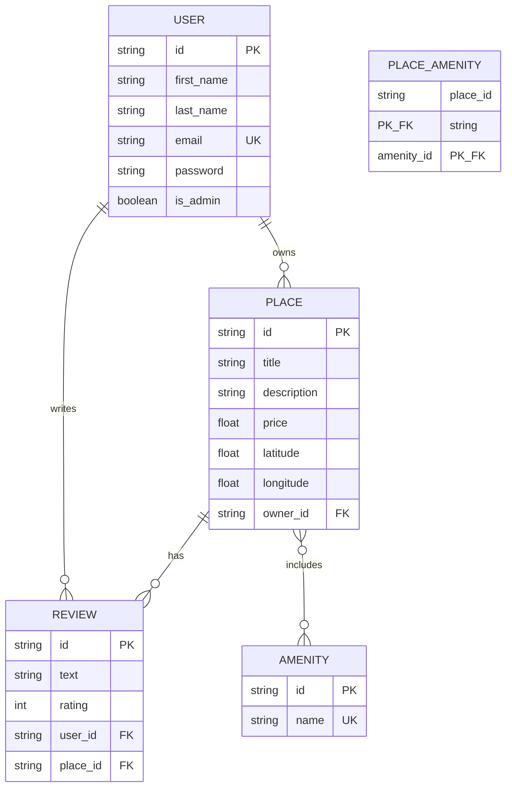

# HBnB ER Diagram - Quick Reference

## Simple Entity Relationship Diagram

## Relationship Summary

- **User → Place**: One user owns many places
- **User → Review**: One user writes many reviews
- **Place → Review**: One place has many reviews
- **Place ↔ Amenity**: Many-to-many through PLACE_AMENITY

## Key Constraints

- User email must be unique
- Amenity name must be unique
- Review rating: 1-5
- One review per user per place
- All foreign keys cascade on delete
