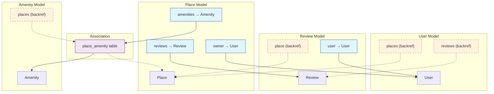

# SQLAlchemy ORM Relationships Diagram

This diagram shows how the SQLAlchemy relationships are defined in the Python models.

## Complete ORM Relationship Map



## Relationship Definitions in Models

### Place Model
```python
# In app/models/place.py

# Association table
place_amenity = db.Table('place_amenity',
    db.Column('place_id', db.String(36), db.ForeignKey('places.id'), primary_key=True),
    db.Column('amenity_id', db.String(36), db.ForeignKey('amenities.id'), primary_key=True)
)

class Place(BaseModel):
    # One-to-Many: Place → User (Many-to-One)
    owner = db.relationship('User', backref='places', lazy=True)
    # Creates: place.owner and user.places

    # One-to-Many: Place → Review
    reviews = db.relationship('Review', backref='place', lazy=True, cascade='all, delete-orphan')
    # Creates: place.reviews and review.place

    # Many-to-Many: Place ↔ Amenity
    amenities = db.relationship('Amenity', secondary=place_amenity, lazy='subquery',
                                backref=db.backref('places', lazy=True))
    # Creates: place.amenities and amenity.places
```

### Review Model
```python
# In app/models/review.py

class Review(BaseModel):
    # Many-to-One: Review → User
    user = db.relationship('User', backref='reviews', lazy=True)
    # Creates: review.user and user.reviews

    # Note: review.place is created by backref in Place.reviews
```

### User Model
```python
# In app/models/user.py

class User(BaseModel):
    # Relationships created via backrefs:
    # - user.places (from Place.owner backref)
    # - user.reviews (from Review.user backref)
    pass
```

### Amenity Model
```python
# In app/models/amenity.py

class Amenity(BaseModel):
    # Relationships created via backrefs:
    # - amenity.places (from Place.amenities backref)
    pass
```

## Navigation Examples

### Forward Navigation (Relationship)
```python
# Place → User (owner)
place = Place.query.first()
owner = place.owner  # Get the owner User object

# Place → Reviews
reviews = place.reviews  # Get all Review objects for this place

# Review → User
review = Review.query.first()
user = review.user  # Get the User who wrote this review

# Review → Place
place = review.place  # Get the Place this review is for

# Place → Amenities
amenities = place.amenities  # Get all Amenity objects for this place
```

### Backward Navigation (Backref)
```python
# User → Places
user = User.query.first()
places = user.places  # Get all Place objects owned by this user

# User → Reviews
reviews = user.reviews  # Get all Review objects written by this user

# Amenity → Places
amenity = Amenity.query.filter_by(name='WiFi').first()
places = amenity.places  # Get all Place objects that have this amenity
```

## Lazy Loading Options

| Option | Description | Use Case |
|--------|-------------|----------|
| `lazy=True` | Load on access (default) | Most common, loads when needed |
| `lazy='subquery'` | Load with subquery | Better for collections, avoids N+1 |
| `lazy='joined'` | Load with JOIN | Good for single relations |
| `lazy='dynamic'` | Returns query object | When you need to filter further |

## Cascade Options

### Place → Review
```python
cascade='all, delete-orphan'
```
- Deleting a Place deletes all its Reviews
- Removing a Review from place.reviews deletes it from database

### Other Relationships
Default cascade behavior (no automatic deletion of children)

## Relationship Access Patterns

### One-to-Many (Place → Review)
```python
# Forward: place.reviews → List[Review]
place = Place.query.get(place_id)
for review in place.reviews:
    print(f"Rating: {review.rating}")

# Backward: review.place → Place
review = Review.query.get(review_id)
print(f"Place: {review.place.title}")
```

### Many-to-One (Place → User)
```python
# Forward: place.owner → User
place = Place.query.get(place_id)
print(f"Owner: {place.owner.email}")

# Backward: user.places → List[Place]
user = User.query.get(user_id)
for place in user.places:
    print(f"Place: {place.title}")
```

### Many-to-Many (Place ↔ Amenity)
```python
# Forward: place.amenities → List[Amenity]
place = Place.query.get(place_id)
for amenity in place.amenities:
    print(f"Amenity: {amenity.name}")

# Backward: amenity.places → List[Place]
amenity = Amenity.query.filter_by(name='WiFi').first()
for place in amenity.places:
    print(f"Place: {place.title}")

# Add amenity to place
place.amenities.append(amenity)
db.session.commit()

# Remove amenity from place
place.amenities.remove(amenity)
db.session.commit()
```

## Query Optimization with Relationships

### Eager Loading (Avoid N+1 Queries)
```python
from sqlalchemy.orm import joinedload

# Bad: N+1 queries
places = Place.query.all()
for place in places:
    print(place.owner.email)  # Triggers a query for each place

# Good: Single query with join
places = Place.query.options(joinedload(Place.owner)).all()
for place in places:
    print(place.owner.email)  # No additional queries
```

### Subquery Loading
```python
from sqlalchemy.orm import subqueryload

# Load all reviews in a subquery
places = Place.query.options(subqueryload(Place.reviews)).all()
for place in places:
    for review in place.reviews:
        print(review.text)
```

## Common Patterns

### Create with Relationships
```python
# Create place with owner
owner = User.query.get(user_id)
place = Place(title="Cozy Apartment", price=120, owner_id=owner.id)
db.session.add(place)
db.session.commit()

# Access relationship immediately
print(place.owner.email)
```

### Add to Collections
```python
# Add amenities to place
place = Place.query.get(place_id)
wifi = Amenity.query.filter_by(name='WiFi').first()
pool = Amenity.query.filter_by(name='Swimming Pool').first()

place.amenities.extend([wifi, pool])
db.session.commit()
```

### Filter by Relationship
```python
# Get all places owned by admin users
admin_places = Place.query.join(User).filter(User.is_admin == True).all()

# Get all places with WiFi
wifi = Amenity.query.filter_by(name='WiFi').first()
wifi_places = Place.query.filter(Place.amenities.contains(wifi)).all()

# Get all reviews with rating >= 4
good_reviews = Review.query.filter(Review.rating >= 4).all()
```

## Relationship Diagram Legend

- **Solid Line (→)**: Direct relationship defined in model
- **Dashed Line (-.->)**: Backref (reverse relationship)
- **Blue Box**: Forward relationship attribute
- **Orange Box**: Backref attribute
- **Purple Box**: Association table

---

**Note**: All relationships in this application use SQLAlchemy's ORM capabilities to provide intuitive Python object navigation while maintaining proper database foreign key constraints.
